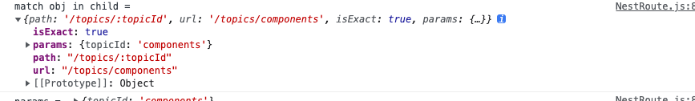
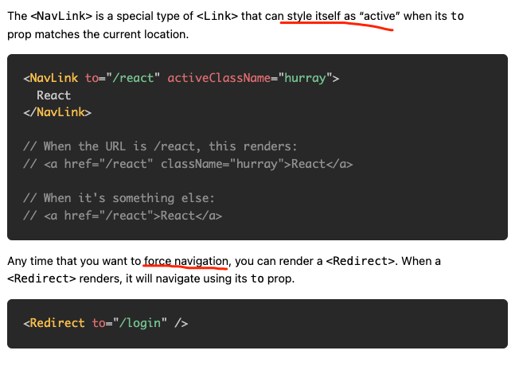

### 注意本demo使用的版本为"react-router-dom": "5"
### 基本路由
几个核心组件
- BrowserRouter (一般会重命名为Router)
- Link
- Route
- Switch
```jsx
import {BrowserRouter as Router,Link,Route,Switch} from 'react-router-dom'
function BasicRoute() {
  	return(
      <Router>
        <nav>
          <ul>
            <li><Link to="/about">About</Link></li>
            <li><Link to="/user">User</Link></li>
            <li><Link to="/">Home</Link></li>
          </ul>
        </nav>
        <Switch>
          <Route path="/about">
            <About />
          </Route>
          <Route path="/user">
            <User />
          </Route>
          <Route path="/">
            <Home />
          </Route>
        </Switch>
      </Router>
    )
}
export default BasicRoute;
```


路由设置的注意点：

```jsx
 {/* A <Switch> looks through its children <Route>s and
            renders the first one that matches the current URL. */}
```

当你如下定义路由的时候，都会命中 `/`

```jsx
<Switch>
  <Route path="/">
    <Home />
  </Route>
  <Route path="/users">
    <Users />
  </Route>
  <Route path="/about">
    <About />
  </Route>
</Switch>
```


1. `/`

2. `/users`

3. `/about`

也就是说路由的在Switch中的顺序很重要,他会遍历其子元素，匹配到就停止了。当你跳转到`/home`或者`/user`的时候，会命中`/`。 出现如下的效果：


如何解决？	

```js
Because of this, we typically put this <Route> last in our <Switch>. Another possible solution is to use <Route exact path="/"> which does match the entire URL.
```

1. 配置路由的时候，越具体的放在前面
2. 使用 `exact`开启精确的匹配。

### 嵌套路由

```js
import {
  BrowserRouter as Router,
  Link,
  Route,
  Switch
} from 'react-router-dom'

function NestRoute() {
  return(
  )
}
```




### 路由基本概念
- routers: `<BrowserRouter>` 和 `<HashRouter>`

回顾：URL的组成： 协议，域名，端口，路径，参数，哈希

```js
http://test.com/user?name=bob#top
协议: http
域名: test.com
端口：http协议默认为80，这里没有写出，所以使用默认的,就是80
路径: /user
参数: 也就是问号后面的,name=bob
哈希: 就是#符号开头，#top
```

区别：两者存储URL信息的方式不同。前者使用URL的**路劲**部分来表示信息，而后者使用URL的**hash部分**来表示信息。

是否发送请求对于单页应用而言：

```js
1. BrowserRouter: Specifically, your web server needs to serve the same page at all URLs that are managed client-side by React Router. url改变，因此会发送请求，需要服务端来配合
2. HashRouter: Since the hash is never sent to the server, this means that no special server configuration is needed. 不会发送请求
```

如何使用？包裹最顶层的组件 `<App />`

- To use a router, just make sure it is rendered at the root of your element hierarchy. Typically you’ll wrap your top-level `<App>` element in a router, like this:

```jsx
function App() {
  return <h1>Hello world</h1>
}
ReactDOM.render(
  <BrowserRouter>
    <App />
  </BrowserRouter>,
  document.getElementById('root')
)
```


- route matchers: `<Route>`和`<Switch> ` 路由

作用：就是用来做路由匹配的！

如何使用？ 把`Route`放在`Switch`作为子组件来使用

```jsx
<Switch>
  <Route path="/user">
    <User />
  </Route>
  <Route path="/">
    <Home />
  </Route>
</Switch>
```

建议：**越具体的路径，放在前头**。 原文如下：

```js
When a <Switch> is rendered, it searches through its children <Route> elements to find one whose path matches the current URL. When it finds one, it renders that <Route> and ignores all others. This means that you should put <Route>s with more specific (typically longer) paths before less-specific ones.
```

- 使用 exact属性来避免坑，这一意味着对整条路径进行匹配。

```js
One important thing to note is that a <Route path> matches the beginning of the URL, not the whole thing. So a <Route path="/"> will always match the URL. Because of this, we typically put this <Route> last in our <Switch>. Another possible solution is to use <Route exact path="/"> which does match the entire URL.
```




- Navigation-route changer: `<Link>`， `NavLink`, `Redirect`

1. Link: 实际上渲染的是a标签
2. NavLink ???
3. Redirect 使用to属性来设置路径，进行重定向（强制跳转）??

```js
Any time that you want to force navigation, you can render a <Redirect>. When a <Redirect> renders, it will navigate using its to prop.
<Redirect to="/login" />
```

