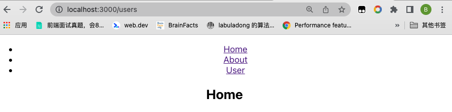

### 注意本demo使用的版本为"react-router-dom": "5"
### 基本路由
几个核心组件
- BrowserRouter (一般会重命名为Router)
- Link
- Route
- Switch
```jsx
import {BrowserRouter as Router,Link,Route,Switch} from 'react-router-dom'
```


路由设置的注意点：

```jsx
 {/* A <Switch> looks through its children <Route>s and
            renders the first one that matches the current URL. */}
```

当你如下定义路由的时候，都会命中 `/`

```jsx
<Switch>
  <Route path="/">
    <Home />
  </Route>
  <Route path="/users">
    <Users />
  </Route>
  <Route path="/about">
    <About />
  </Route>
</Switch>
```


1. `/`

2. `/users`

3. `/about`

也就是说路由的在Switch中的顺序很重要,他会遍历其子元素，匹配到就停止了。当你跳转到`/home`或者`/user`的时候，会命中`/`。 出现如下的效果：

